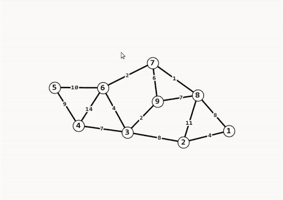

# Graph OpenSource Display and Algorithms
[](https://travis-ci.com/pds2-dcc-ufmg/2019-1-grupo19)

## Introduction

This project is a open source app for graphs, with an integrated display,  a REPL for rapid analysis and a variety of graph algorithms. Feedback is welcomed :)  

For examples, check our video: [Portuguese](https://www.youtube.com/watch?v=MY5hHPIj3cg)



## Creators
All of the creators are undergrad students at Universidade Federal de Minas Gerais (UFMG), Brazil.

- Ariel Santos - ariel.santos@dcc.ufmg.br
- Bruno Monteiro 
- Francisco Galuppo - franciscogaluppo@dcc.ufmg.br
- Luiza Campos - luiza.chagas@dcc.ufmg.br

## Dependencies to compile
- CMake 2.6+
- gcc & g++ 5.5+
- SFML 2.4+ (headers)
- TGUI 0.8 (headers)

### How to install the dependencies:
A simple script for Ubuntu 18.04+
```bash
sudo add-apt-repository ppa:texus/tgui-0.8
sudo apt-get update
sudo apt-get install libsfml-dev libtgui-dev
```
Or use the Dockerfile.

## How to develop locally:
```bash
# Good practices
mkdir build && cd build
# Compilation scripts for your plataform
cmake ..
# Compile
make
# Testing
make tests
# Create a documentation in /docs
make docs
# Execute
make run
```

## Using the REPL
Our REPL have two types of commands: assignment and operation.

### Assignment

#### Variable assignment
```
>>> var1 = var2
```
Variable *var1* represents the same graph as *var2*.

#### import
```
>>> var = import file_name
```
Variable *var* represents the graph in *file_name*. If this fails, *var* is a empty graph.

#### mst
```
>>> var1 = mst var2
```
Variable *var1* is the **Maximum Spanning Tree** of *var2*'s graph'.

### Operation

#### describe
```
>>> var > describe
```
A summary of  *var*.

#### show
```
>>> var > show
```
Shows the graph in *var*.

#### edit
```
>>> var > edit
```
Shows the graph in *var*, saving changes.

#### reaches
```
>>> var > reaches a b
```
Verifies if *a* reaches vertice *b* in *var*.

#### scc
```
>>> var > scc
```
Strong connected components of *var*.

#### shortestPath
```
>>> var > shortestPath a b
```
Shortest path length from *a* to vertice *b* in *var*.

#### coloring
```
>>> var > coloring
```
Computes a minimum coloring for *var*, if *var* is a chordal graph (polynomial time).

#### chromaticNumber
```
>>> var > chromaticNumber
```
Computes the chromatic number of *var*, if *var* is a chordal graph (polynomial time).

#### greedyColoring
```
>>> var > greedyColoring
```
Computes a coloring using a greedy algorithm on the vertex ordering. Linear time.

#### maximumCliqueSize
```
>>> var > maximumCliqueSize
```
Computes the size of the largest clique of *var*, if *var* is a chordal graph (polynomial time).

#### artPoints
```
>>> var > artPoints
```
Vertices whose removals increases the number of connected components of *var*

#### bridges
```
>>> var > bridges
```
Edges whose removals increases the number of connected components of *var*

#### topoSort
```
>>> var > topoSort
```
Create a topological ordering of the vertices.

#### center
```
>>> var > center
```
Computes the center of the tree *var*.

#### diameter
```
>>> var > diameter
```
Computes the diameter of the tree *var*.
